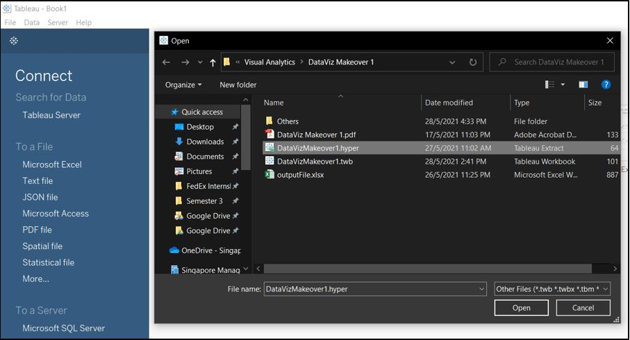

```{r setup, include=FALSE}
knitr::opts_chunk$set(echo = FALSE)
```

# 1.0 ORIGINAL VISUALIZATION

 
The above chart shows a visualization depicting merchandising trade of the top six trading countries from 2019-2020. The data is available at [https://www.singstat.gov.sg/find-data/search-by-theme/trade-and-investment/merchandise-trade/latest-data](https://www.singstat.gov.sg/find-data/search-by-theme/trade-and-investment/merchandise-trade/latest-data), and can be downloaded from the Merchandise Trade by Region/Market section under ‘Download all in Excel’.

Before we analyse the visualization, it is important to gain a clear understanding of the context of the visualization and the data it represents.

*	Data is meant to represent Singapore’s trade values (Exports and Imports) with its top six trading partners
*	Visualization is indicated by the title to be from 2019 to 2020
*	Both the visualization and underlying data source do not indicate the currency in which these trade values are published, hence for the purposes of this project we shall make the assumption of values being in Singapore dollars, reasonable given that the data comes from a government agency


# 2.0 CRITIQUE OF VISUALIZATION

## 2.1 Clarity

1. The chart title is not very clear; a first-time reader might misidentify the visualization to be about the total value of international trade that each of the countries conducted, and that these six countries represent the top six countries in the world in terms of trade value. Instead the data is referring to value of trade each country conducts with Singapore, and that these countries represent Singapore’s top six trading partners.

2. The title states that the period of data the visualization is meant to display is from 2019 to 2020. That itself is not clear; should we take it to mean from Jan 2019 to Jan 2020, or perhaps Jan 2019 to Dec 2020? For this project however, we shall assume a consistent period range of Jan 2019 to Dec 2020 for all values.
  
    + Furthermore, the horizontal axes of the six charts have different ranges, with Japan seemingly having a range that only covers 2020.
  
3. The vertical axes for the six charts are all in different ranges, making it hard to compare between countries.

4. The visualization intends to depict trade values over months, but using an area-type chart which makes it hard to tell the values of each month, and identify which months have specific trends (e.g. spikes, troughs).

5. The chart does not explicitly state the denomination of the values shown, and readers might be misled into thinking that the trade volumes range from a few hundred thousand to a few million. Yet, upon closer inspection of the underlying data source, the values are actually given in denominations of thousands ($000s) and actual trade volumes range from a few hundred million to billions.

## 2.2 Aesthetics

1. The width size of each chart are different from each other, making the visual not aesthetically balanced.

2. The positioning of the charts does not make it easy for country-to-country comparison – they are too far apart and having 3 countries on top and 3 countries below is not ideal for comparison.

3. The use of overlapping area charts with the orange import overlaid on the blue export values makes it not too pleasing on the eyes, it might take reader’s eyes a while to adjust to finding the blue values especially when they are ‘hidden’ behind the orange area.


# 3.0 PROPOSED ALTERNATIVE DESIGN


## 3.1 Advantages of New Design

1. Title changed to better reflect the objective and period range of the visualization. Subtitle added to include a short summary of key findings.

2. Chart type changed to bar chart, to enable ease of month-to-month comparisons.

3. Separated export and import trade values, with import values displayed in a reverse (upside-down) manner, to enable easier-on-the-eye comparison between the magnitudes of export and import volumes.

4. To ease country-to-country comparison, certain changes were made:

    a. Charts are placed side by side each other on the same level
    b. Horizontal axes and chart width were standardized
    c. Vertical axes standardized to 0 to 8 billion

5. For each chart (export and import), categorise values into two types – if an export / import value is higher than its export / import counterpart in the same month, that value will contain a darker shade of the colour scheme used. This enables reader to easily identify in which months Singapore had more net exports or imports for each of their trading partners.

6. Included additional information on trade totals:
    
    a. Aggregated totals of export and import trade volumes in the period range
    b. Calculated export and import differences to find out whether Singapore has trading surpluses or deficits with each trading partner
    

# 4.0 DATA PREPARATION

The data was first cleaned and prepared using Tableau Prep Builder and then loaded into and visualized using Tableau.

## 4.1 Importing Data

1. Create a connection to the data source.

2. Drag the tables (T1 and T2) to edit into the canvas to start their respective flows. From this point onwards, both tables shall be handled in the same manner until the moment they are joined.

3. Tick the ‘Use Data Interpreter’ check box.

{width=60%}

4. Tableau’s Data Interpreter will try its best to figure out the underlying table structure in each worksheet. The result of cleaning with Data Interpreter are as follows:

**Original**


**After Data Interpreter is Used**


## 4.2 Pivoting Data

1. Click on the ‘+’ sign beside the table and select ‘Pivot’
  
2. On the left panel, select all fields except ‘Subject: Merchandise Trade’ and drag them to the ‘Pivoted Fields’ pane.

{width=70%}

3. After pivoting the relevant fields, add another step to ‘clean’ data.

{width=60%}


## 4.3 Cleaning Data

1. Rename the fields accordingly

2. Create a calculated field to derive the actual value of each row


3. Filter for the six countries we want


4. Convert the ‘Year Month’ field into a date time format


5. Filter for the time period we want.

{width=60%}


## 4.4 Joining Data

1. Add a new step to join the two cleaned tables.

2. Under settings, apply two join clauses: Period and Country. Output should be a total of 144 resulting rows.


3. Create an additional clean step.

    a. Remove duplicated fields
    b. Create 2 additional fields to indicate if i) Exports > Imports and ii) Imports > Exports (this will be used to supplement the visualization in Tableau later on)


## 4.5 Run Output Flow

1. Add an Output step and click ‘Run Flow’ to save the data as a Tableau Data Extract (.hyper)


# 5.0 DATA MAKEOVER WITH TABLEAU

## 5.1 Makeover Original Chart

### 5.1.1 Importing Data into Tableau

1. Launch Tableau Desktop, and under the ‘Connect To a File’ section select ‘More’. Navigate to the Tableau Data Extract file we have just saved.



2. Rename ‘Sheet 1’ to ‘Main’. Navigate to ‘Main’ to begin makeover. Result of the connection will look like this:


### 5.1.2 Create Chart

1. Drag ‘Country’ and ‘Period’ into ‘Columns’ shelf. Click on the dropdown arrow on the ‘Period’ icon and select the second ‘Month’ option to drill down the period display into months.


2. Drag the ‘Export’ and ‘Import’ measures into the ‘Rows’ shelf. The default chart displayed is a line chart. Under the ‘All’ section in the ‘Marks’ shelf, select the dropdown menu to change chart type to ‘Bar’.


3. For both Import and Export axes, right-click on each axis and perform the following actions:

    a. Set fixed range – Fixed Start: 0, Fixed End: 8,000,000,000
    b. Rename Axis Title – Export / Import **($SGD)**
    c. For **Import Axis only**: Check the ‘Reversed’ box


### 5.1.3 Colourize Chart

1. Under the ‘SUM(Export)’ mark, drag the ‘Export > Import?’ measure into the ‘Color’ box, repeat the steps for the ‘SUM(Import)’ mark using the ‘Import > Export?’ measure.


2. Under the colour legend, click the dropdown arrow and select ‘Edit Colors’.


3. In the ‘Edit Colors’ settings, we will edit the colours of the bars. 

For the Import data, we will use the orange colour scheme, with a darker shade to represent months where imports exceed exports, and a lighter shade to represent months where the imports are less than exports.

For the Export data, we will use the green colour scheme, with a darker shade to represent months where exports exceed imports, and a lighter shade to represent months where the exports are less than imports.


The result will look something like this:


### 5.1.4 Edit Title

1. Change the title and add subtitle to better reflect the summary and objectives of the visualization


## 5.2 Create Totals Table

We will now create a table to display Singapore’s total trade volumes with each of their trading partners over the selected period.


### 5.2.1 Create new sheet and new calculated field

1. Create new sheet and rename to ‘Totals’.

2. In the ‘Tables’ section right-click and select ‘Create Calculated Field’. Create a new calculation showing the difference between Export and Import (i.e. Export-Import).


### 5.2.2 Select Relevant Data to Display

1. Drag ‘Country’ and ‘Period’ into ‘Columns’ shelf.

2. Drag ‘Measure Values’ into the ‘Text’ box under the ‘Marks’ shelf.

3. Click on the dropdown arrow of each of the ‘Measure Values’ and format number to show the currency and numbers in Billions with 1 decimal place.

{width=60%}

4. Drag ‘Measure Names’ into the ‘Rows’ shelf.

5. Delete ‘CNT(Extract)’ from the ‘Measure Values’ shelf.

6. Drag ‘Measure Values’ into the ‘Color’ box under the ‘Marks’ shelf. 

7. Under the ‘Analysis’ toolbar, navigate to ‘Totals’ and select ‘Show Row Grand Totals’.

8. Rearrange the values so that ‘SUM(Difference)’ is at the bottom. Result will look like this:


### 5.2.3 Editing the Colour scheme for table data

1. Click on the dropdown arrow of ‘Measure Values’ with the colour icon, and select ‘Use Separate Legends’.

{width=40%}

2. Under the colour legend on the right-hand side of the window, click the dropdown arrow of ‘SUM(Export)’ and select ‘Edit Colors’. In the ‘Edit Colors’ settings, we will edit the colours for the Export and Import values.

    Select ‘Custom Diverging’ from the ‘Palette’ dropdown list. Check the ‘Stepped Color’ option and change to 2 steps. Change both colours on the left and right side of the palette to black. Check ‘Include Totals’ box. Click ‘Apply’     and then ‘OK’. Click the dropdown arrow for ‘SUM(Exports)’ colour legend and select ‘Hide Card’.

    Repeat steps for ‘SUM(Import)’ colour legend.

{width=50%}

3. Under the colour legend on the right-hand side of the window, click the dropdown arrow of ‘SUM(Differences)’ and select ‘Edit Colors’. In the ‘Edit Colors’ settings, we will edit the colours for the Difference values.

    Select ‘Custom Diverging’ from the ‘Palette’ dropdown list. Check the ‘Stepped Color’ option and change to 2 steps. Change the left side to red and the right side to green. Click ‘Advanced’ option and tick the ‘Center’ box and type in 0. Check ‘Include Totals’ box. Click ‘Apply’ and then ‘OK’. Click the dropdown arrow for ‘SUM(Difference)’ colour legend and select ‘Hide Card’.

{width=50%}

4. Rename table to ‘Trade Totals’. Result table will look like this:


5. Right-click anywhere on the canvas and click ‘caption’. A caption should appear at the bottom of the canvas. Double-click on the caption window and edit the caption to show the source of data.


## 5.3 Create Dashboard and Combine Charts

1. In the pages tab at the bottom of the window, click ‘New Dashboard’ icon to open up a new dashboard.

{width=80%}

2. Under the ‘Size’ options, select ‘Automatic’.

{width=40%}

3. Drag and drop both the ‘Main’ and ‘Totals’ sheet into the windows, with the ‘Main’ sheet above and ‘Totals’ sheet below. Right-click on any blank space in the ‘Trade Totals’ sheet and select the ‘Caption’ option. Realign the data tables from both sheets accordingly so they align together nicely. The result should look something like this:


**Voila! We have created our first dashboard!** Visit this link to access the dashboard on Tableau Public: [Tableau Public Dashboard](https://public.tableau.com/app/profile/ryan.chan8444/viz/DataVizMakeover1SingaporesMerchandiseTradewithTopSixTradingCountries2019-2020/Dashboard)


# Major Observations


1. Over the selected period, we can observe that, except for a few months, we can see a relatively clear trend of Mainland China consistently ranking as Singapore’s top trading partner in terms of trade volumes for both exports and imports.

2. Hong Kong’s entry into the top six trading partners list is due to Singapore being an extremely high exporter to Hong Kong, with relatively very low imports. On the other hand Taiwan  is the opposite, where the import trade values consistently exceeds the export trade values.

3. From the Trade Totals table, it can be seen that Singapore experienced trade surpluses with Hong Kong and Mainland China, and trade deficits with Japan, Malaysia and Taiwan, in both 2019 and 2020. Singapore experienced a trade deficit in 2019, however turning it around to a trade surplus in 2020. Overall, Singapore remained a net exporter over the 2-year period, with a trade surplus of ~S$52.7 billion.


Thank you for reading, we hope you have learnt something new and enjoyed the process!

Ryan
