```{r setup, include=FALSE}
knitr::opts_chunk$set(echo = FALSE)
```


# 1.0 ORIGINAL VISUALIZATION


 

The above chart shows a visualization depicting merchandising trade of Singapore’s trading partners from 2011-2020. The visualization comes from the Department of Statistics Singapore International Trade infographic page at [https://www.singstat.gov.sg/modules/infographics/singapore-international-trade](https://www.singstat.gov.sg/modules/infographics/singapore-international-trade), and the dataset can be downloaded from the under the sub-section of Merchandise Trade by [Region/Market section](https://www.singstat.gov.sg/find-data/search-by-theme/trade-and-investment/merchandise-trade/latest-data) under ‘Download all in Excel’.

Before we analyse the visualization, it is important to gain a clear understanding of the context of the visualization and the data it represents.

* Data represents Singapore’s trade values (Exports and Imports) with its top 10 trading partners, in year 2020.
* Visualization utilizes a scatterplot chart as the foundation, with export value on the X-axis and import value on the Y-axis. The size of each bubble / point indicates the total trade volume.

# 2.0 CRITIQUE OF VISUALIZATION
## 2.1 Clarity

1. Using sized bubbles as the data points for a scatterplot chart makes it very hard for the user to accurately identify the exact origin point, any user who wants to estimate the export and import values will find it hard to do so. Furthermore, what is the point of assigning the total trade volume to size of the bubble, when it is intuitively clear that any point nearer to the top right of the chart will be huge and points nearer to the bottom left will be small?

2. The chart only states the total trade amount for each trading partner, there is no clear labelling or indication of the exact export and import values.

3. When mouse is hovered over a trading partner, that corresponding bubble selection will move to be on the front most panel, and potentially obscure the other bubbles and their trade amounts. This is not friendly to a user who would like to compare two partners’ trade amounts.

## 2.2 Aesthetics

1. The size of each bubble is too huge and unnecessary, and only serves to contribute to the obscuring problem mentioned above. 

2. There is a default overlay position where if left untouched some bubbles are always on top of other bubbles. However, when a mouse is hovered over a particular bubble the bubble will come to the front, only for it disappear to the back again once the mouse has left the bubble. This can be an eyesore for a user who is having to move his / her mouse around the chart and constantly seeing bubbles ‘popping’ and ‘disappearing’ in quick fashion.

3. The use of colours seem to be arbitrary in this chart, there is no clear function that each colours serves except to differentiate each country. This is never good practice, to implement a functionality that does not help the user in any way in his / her analysis of the data.


# 3.0 Proposed Alternative Design

 

Two charts are introduced.

1. The chart on the left retains the foundation build of the original visualization, with several tweaks. 

    + It is still a scatterplot with each dot representing the export and import values for each trading partner. 
    + The size function from the original visualization are discarded, so the chart will not be so convoluted.
    + A 45-degree reference line is created such that any point above the line is a Net Importer and any point below the line is a Net Exporter.
    + Two colours are introduced, green for partners that are net exporters and red for partners that are net importers.
    + Tooltips will include useful information such as total trade volume, whether partner is a net exporter or importer, net (export / import) trade value and export / import values.
    
2. The chart on the right is a combination of bar charts.

    + Each row on the chart represents a trading partner.
    + For each row, the partner’s import value will be shown as a reversed horizontal bar on the left, and export value as a normal horizontal bar on the right.
    + Within the bars of each row, a corresponding net trade value will be shown (i.e. if partner is a net exporter, a smaller bar representing the net export trade value will appear within the export bar with a label to indicate the net trade value)
    + Net exporters will have their export bars highlighted in green, while net importers will have their import bars highlighted in red.
    + Tooltips will include useful information such as total trade volume, whether partner is a net exporter or importer, their net exporter / importer rank, net (export / import) trade value and export / import values.
    
3. Several controls will be utilized for the user to interact with the visualization

    + A year slider will allow user to scroll through the data by year
    + A country filter will allow user to select only specific partners he / she wants to see, or to exclude certain specific partners
    + ‘Top N Partners’ allows typed-in integers that will limit both charts to showing a limited amount of countries, based on the selected ranking type
    + ‘Rank By’ is a parameter allowing user to select Top N Partners based on the following rank types: Total Trade, Net Exporter and Net Importer. This function will also change the order of partners that the right chart displays, with the highest value partner on top.


# 4.0 DATA PREPARATION

The data was first cleaned and prepared using Tableau Prep Builder and then loaded into and visualized using Tableau.

## 4.1 Importing Data

1. Create a connection to the data source.

2. Drag the tables (T1 and T2) to edit into the canvas to start their respective flows. From this point onwards, both tables shall be handled in the same manner until the moment they are joined.

3. Tick the ‘Use Data Interpreter’ check box.

{width=60%}

4. Tableau’s Data Interpreter will try its best to figure out the underlying table structure in each worksheet. The result of cleaning with Data Interpreter are as follows:

**Original**


**After Data Interpreter is Used**


## 4.2 Pivoting Data

1. Click on the ‘+’ sign beside the table and select ‘Pivot’
  
2. On the left panel, select all fields except ‘Subject: Merchandise Trade’ and drag them to the ‘Pivoted Fields’ pane.

{width=70%}

3. After pivoting the relevant fields, add another step to ‘clean’ data.

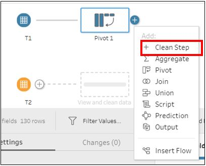{width=60%}

## 4.3 Cleaning Data

1. Rename the fields accordingly

2. Create a calculated field to derive the actual value of each row


3. Use the filter function to exclude continents


4. Convert the ‘Year Month’ field into a date time format

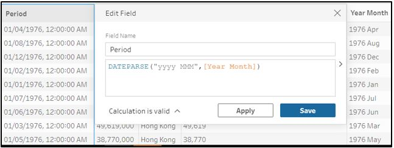


5. Filter for the time period we want.


## 4.4 Joining Tables

1. Add a new step to join the two cleaned tables.
2. Under settings, apply two join clauses: Period and Country. Change the join type to ‘Right’ (i.e. ensure the entire ‘Clean 1’ circle is shaded in the venn diagram. Output should be a total of 13,320 values.
3. Remove duplicated fields


4.	For both Export and Import values, use the function ZN() to convert null values to 0.


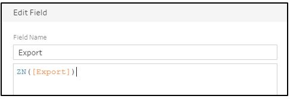


5. Create an aggregate step.

    a. Drag ‘Period’ and ‘Country’ to the Grouped Fields, and ‘Export’ and ‘Import’ to the Aggregated Fields.


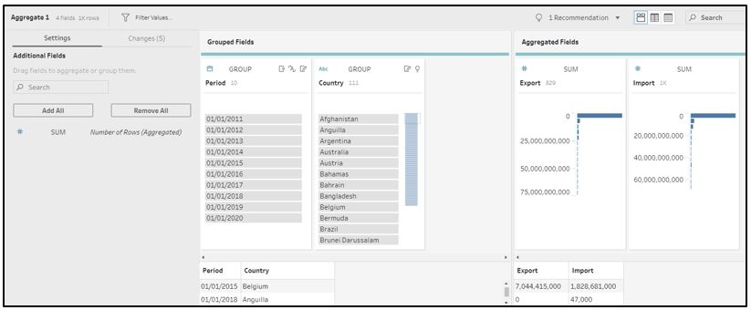


    b.	Under the Period field in the Grouped Fields, convert dates to year number
    


    c.	In the top left hand corner of the Period field, click the icon and change the data type to ‘Date’.
    
{width=60%}


## 4.5 Run Output Flow

1.	Add an Output step and click ‘Run Flow’ to save the data as a Tableau Data Extract (.hyper)


# 5. DATA MAKEOVER WITH TABLEAU

## 5.1 Preparation

### 5.1.1 Importing Data into Tableau

1.	Launch Tableau Desktop, and under the ‘Connect To a File’ section select ‘More’. Navigate to the Tableau Data Extract file we have just saved.


2.	Result of the connection. Rename ‘Sheet 1’ to ‘Scatterplot’. Navigate to ‘Scatterplot’ to begin makeover.


### 5.1.2 Create Calculated Fields / Parameters

Before we begin creating the visualizations proper, we will need to create several calculated fields and parameters that will help us with generating the visuals we want. Follow the formulas below to create the new fields / parameters


**Parameters**

To create a parameter, right-click on the tables pane and click ‘Create Parameter’. Enter the settings as per the screenshots.

{width=60%}


Rank By Parameter

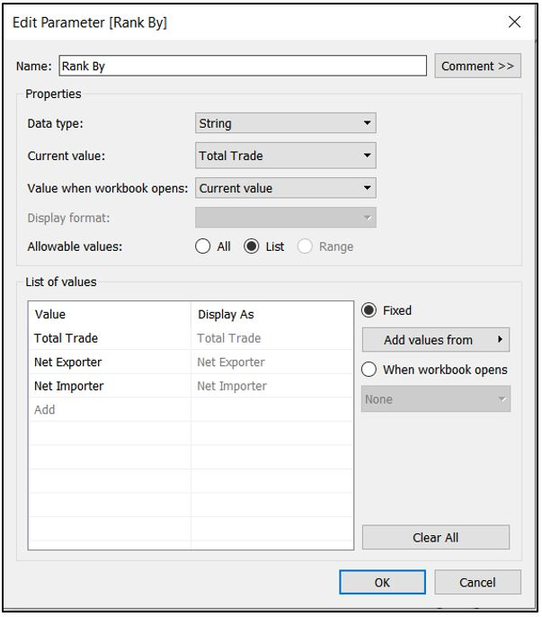


Top N Partners

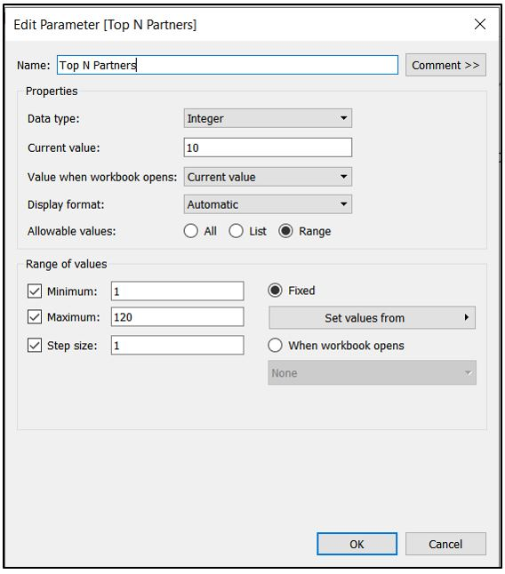


**Calculated Fields**

To create a calculated field, right-click on the tables pane and click ‘Create Calculated Field’. Enter the formulas as per the screenshots.

Trade Volume

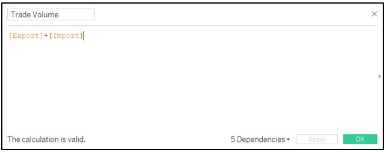

Trade Rank


Net Trade Value


Net Trade Import

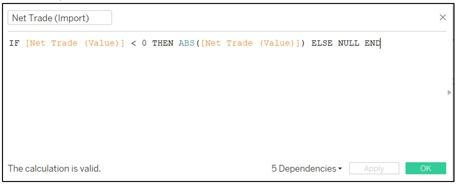

Net Trade Import (Binary)


Net Trade Export


Net Trade Export (Binary)


Net Importer Rank


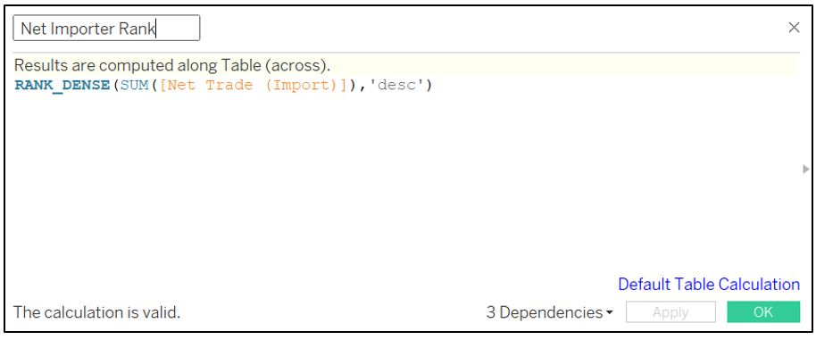

Net Exporter Rank

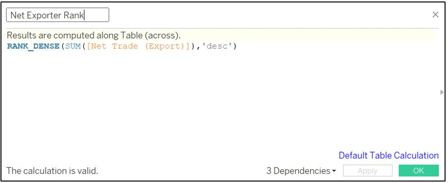


Sorting

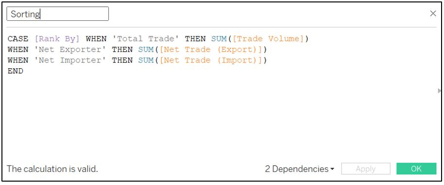


Net Importer


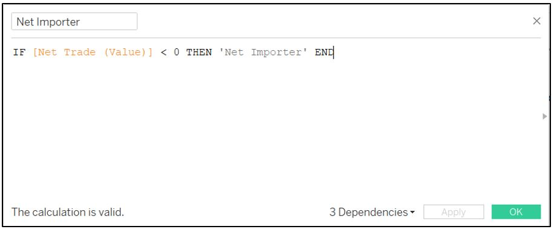


Net Exporter


Import (Name)


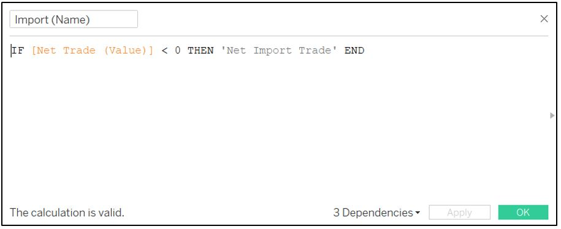


Export (Name)


## 5.2 Makeover Original Visualization

1.	Drag the following measures and dimensions into the following locations:

    a.	Export to Columns
    b.	Import to Columns, then Export to Columns
    c.	Country to Detail Mark


2.	For each of the highlighted axis in the previous screenshot (Import Y-axis and Export X-axis), right-click on the axis and select ‘Edit Axis’. Select ‘Fixed’ Range and key in the range start and end as per the screenshot below.


3.	Right-click on the Export Y-axis and select ‘Dual Axis’ option. Result should look like this:


4.	Remove ‘Measure Names’ from the Color Mark, and right-click on the Export Y-axis and select ‘Synchronise Axis’, and then uncheck the ‘Show Header’ button. You should see a 45-degree diagonal line of data points (see below). Under the Marks for SUM(Export), edit the size and colour of the data points, making the size the smallest, and setting the colours to transparent. 


5.	Right-click anywhere in the chart area and navigate to ‘Trend Lines’, then ‘Show Trend Lines’, then select ‘SUM(Export)’. Result should look like this:


6. Drag ‘Period’ to Filter and select filter by ‘Year’. When the filter settings page open up, select ‘Use all’ under the ‘General’ tab and click ok. Right-click on the ‘YEAR’ filter and navigate to Apply to Worksheets, and select ‘All Using This Data Source’.


7.	Drag ‘Country’ to Filter. When the filter settings page open up, navigate to the ‘Top’ tab and enter the settings as follows:


{width=60%}


8.	Under the ‘SUM(Import)’ Marks group, drag the following fields into the ‘Tooltip’ box:


{width=50%}


9.	Under the ‘SUM(Import)’ Marks group, change mark type to ‘Circle’, drag ‘Country’ to ‘Label’ and drag ‘Net Trade (Value)’ to ‘Color’. Under the colour legend settings adjust the settings as per the screenshot (see below). Subsequently, hide the colour legend card.


10.	Click on the ‘Tooltip’ under the ‘SUM(Import)’ Marks and enter the following message into the tooltip:


11.	Change the chart title to ‘Trade Volume by Exports / Imports’. Our first chart is completed. End Result should look like this:


## 5.3 Create Trade Rankings Bar Chart

1.	Create a new worksheet and rename it to ‘Bar’. Drag the following measures and dimensions to the following locations:

    a.	Import, Net Trade (Import), Export, Net Trade (Export) into Columns in this order
    b.	Country into Rows
    c.	Note: Filters should already automatically appear as we set filter in previous worksheet to apply to all charts using the same data source.

2.	For each of the Net Trade measure (Import and Export), right-click on the measure and select ‘Dual Axis’ option.


3.	Result should look like the screenshot below. Right-click on Net Trade (Import and Export) axes and select ‘Synchronize Axis’, then uncheck ‘Show Header’.


4.	Right-click on the Import and Export Axes and click ‘Edit Axis’. Select ‘Fixed’ Range and key in the range start and end as per the screenshot below.

    a.	For IMPORT AXIS ONLY, check the ‘Reversed’ option under scale.


5.	Under each of the Net Trade (Import and Export) marks, click on the size option and reduce the size of the bars, until about half the size of the Import / Export bars. Result should look something like the screenshot below. Once complete, under the ‘All’ Marks section remove measure names from the color mark.


6.	Add the following measures and dimensions into the following Mark groups:

    a.	‘All’ Mark Group


{width=50%}


    b.	‘Import’ Mark Group
    
{width=50%}


    c.	‘Net Trade (Import)’ Mark Group. Additionally, click on the color button and adjust the colour to the following settings:
    
    


    d.	‘Export’ Mark Group
    
{width=50%}


    e.	‘Net Trade (Export)’ Mark Group. Additionally, click on the color button and adjust the colour to the following settings:


7.	The result should look like the below screenshot. Click on the color legend options to edit the colours.


8.	At the colour legend settings page, adjust the Import and Export bars’ colours to the following settings:


9.	At the ‘Export’ and ‘Import’ Mark Groups, click on colour and set the opacity to 35%.


{width=60%}


10.	Under the ‘All’ Marks Group, click ‘Tooltip’ and enter the following message into the tooltip:


11.	Right-click on the all the existing parameters (Rank By, Top N Partners) and filters (YEAR, Country) in the filter and parameter panes, and click ‘Show Parameter’ / ‘Show Filter’.

    a.	On the YEAR filter, navigate to the dropdown options and select ‘Single Value (slider)’
    b.	On the Country filter, navigate to the dropdown options and select ‘Multiple Values (dropdown)’
    c.	On the Top N Partners parameter, navigate to the dropdown options and select ‘Type In’


12.	Right-click on Country and select ‘Sort’. Enter the sort settings as follows using ‘Sorting’ as the field name.


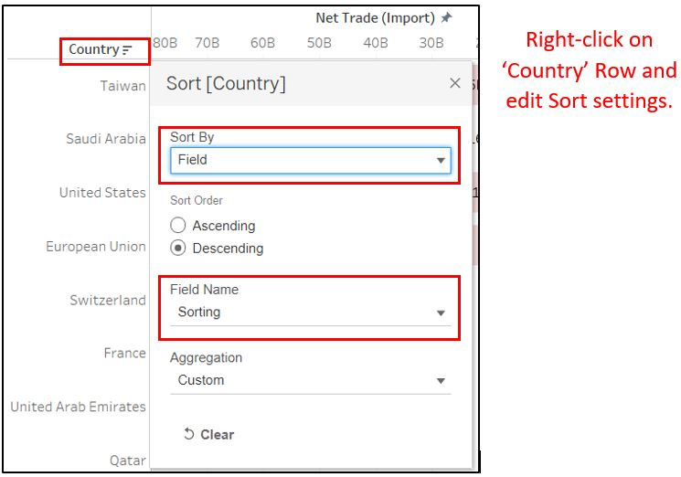{width=60%}


13.	Change the chart title to ‘Trading Rankings’. Our second chart is completed. End result should look like this:


## 5.4 Create Dashboard and Combine Charts


1.	In the pages tab at the bottom of the window, click ‘New Dashboard’ icon to open up a new dashboard.


2.	Under the ‘Size’ options, select ‘Fixed Size’ and adjust size to ‘1366 x 768’.


{width=50%}


3.	Drag and drop both the ‘Bar’ and ‘Scatterplot’ sheets into the dashboard, with the ‘Bar’ sheet on the right and ‘Scatterplot’ sheet on the left. From the Objects shelf on the bottom left corner, drag a text object and place it at the top of both charts. Give the chart a title and short description. The result should look something like this:


Voila! We have created our first dashboard! Visit this link to access the dashboard on Tableau Public: [https://public.tableau.com/app/profile/ryan.chan8444/viz/DataVizMakeover2_16241161747500/Dashboard1](https://public.tableau.com/app/profile/ryan.chan8444/viz/DataVizMakeover2_16241161747500/Dashboard1)


# 6. MAJOR OBSERVATIONS

1.	From 2011 to 2012, Malaysia was Singapore’s top trading partner, with total trade volumes of S$113 billion and S$115 billion respectively.  However, from 2013 onwards, we see that Mainland China took over the top spot as Singapore’s top trading partner, growing from a trade volume of S$116 billion to a record high of S$137 billion in 2019, before dipping slightly to S$136 billion in 2020.


2.	Interestingly, over the last 10 years Hong Kong has been consistently a top importer of Singapore’s goods and services. Singapore has managed to maintain a steady trade surplus of between S$50-60 billion during this period, never once falling outside this range.


3.	Singapore has consistently been a high importer of goods and services from Taiwan, Saudi Arabia and United States. In the last 10 years, these 3 countries have managed to be in the Top 5 Net Importer rankings in all but one year (Taiwan in 2011, Saudi Arabia in 2019 and United States in 2020).


