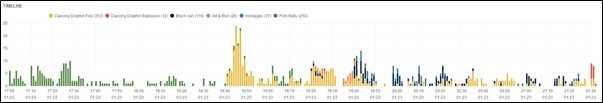
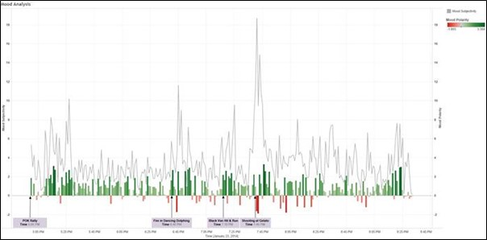
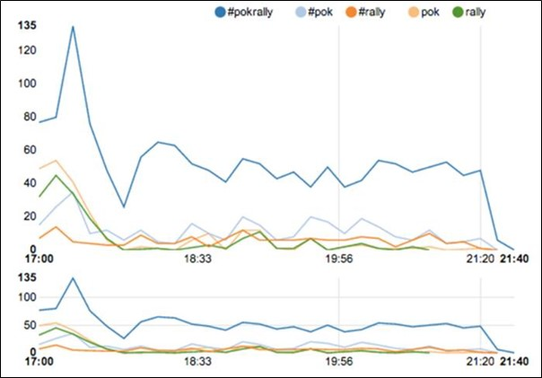
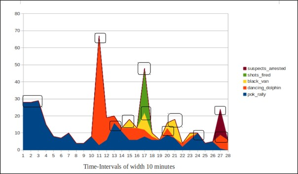
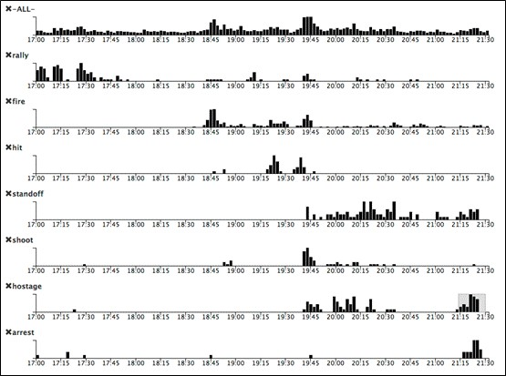
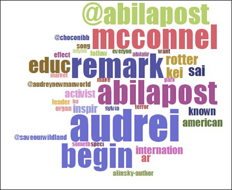
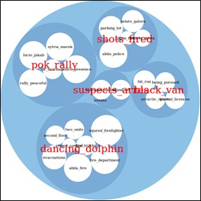
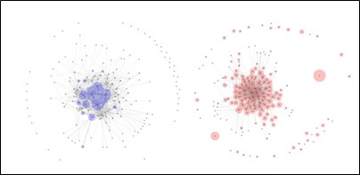
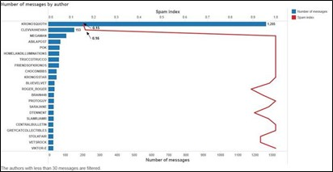

```{r setup, include=FALSE}
knitr::opts_chunk$set(echo = FALSE, message = FALSE, error = FALSE, warning = FALSE, fig.retina = 3)
```


> The write-up below attempts to solve Mini-Challenge 3 from the VAST Challenge 2021. The scenarios presented and all the people, places, groups, technologies, contained therein are fictitious. Any resemblance to real people, places, groups, or technologies is purely coincidental.

# 1. Introduction and Objectives

## Introduction

On the island country of Kronos, a company known as GAStech have been operating a natural gas production facility for the last 20 years. It has produced remarkable profits and developed strong relations with the government of Kronos, albeit not as successful in demonstrating environmental stewardship. In January 2014, the leaders of GAStech are celebrating their new-found fortune because of the initial public offering of their very successful company. Amid this celebration, several employees of GAStech go missing. An organization known as the Protectors of Kronos (POK) is suspected in the disappearance. On the night of January 23, 2014, multiple events took place in the fictional city of Abila, capital of Kronos. As an analyst your job is to perform a retrospective analysis based on limited information about what took place.

The information comes from a single data stream containing two sources:

1. Microblog records (mb) that have been identified by automated filters as being potentially relevant to the ongoing incident

2. Text transcripts (cc) of emergency dispatches by the Abila, Kronos local police and fire departments


## Objectives

The objectives of the analysis are to:

1. Characterise and identify meaningful event reports and distinguish them from typical chatter from junk or spam

2. Represent and evaluate how the level of the risk to the public evolves over the course of the evening

3. Determine a single place to send a team of first responders to, both in retrospect and in real-time. Do the answers differ for both analysis?

# 2. Literature Review

## VAST Challenge 2014

The VAST Challenge 2014 provided the same storyline and data for Mini-Challenge 3. References from taken from some of the top submissions includes several useful techniques that can be used to analyse the text data. They include:

1. Time series plots of relevant and frequent words / hashtags / topics / sentiments across the evening


[Topic Time Series](http://visualdata.wustl.edu/varepository/VAST%20Challenge%202014/challenges/MC3%20-%20Real-Time,%20Streaming%20Social%20Media/entries/University%20of%20Konstanz/)




[Sentiment Time Series](http://visualdata.wustl.edu/varepository/VAST%20Challenge%202014/challenges/MC3%20-%20Real-Time,%20Streaming%20Social%20Media/entries/University%20of%20Buenos%20Aires%20-%20Rukavina/)



[Hashtag Time Series](http://visualdata.wustl.edu/varepository/VAST%20Challenge%202014/challenges/MC3%20-%20Real-Time,%20Streaming%20Social%20Media/entries/Virginia%20Tech/)



[Bi-Gram Time Series](http://visualdata.wustl.edu/varepository/VAST%20Challenge%202014/challenges/MC3%20-%20Real-Time,%20Streaming%20Social%20Media/entries/International%20Institute%20of%20Information%20and%20Technology%20-%20Hyderabad/)


{width=70%}
[Word Time Series](http://visualdata.wustl.edu/varepository/VAST%20Challenge%202014/challenges/MC3%20-%20Real-Time,%20Streaming%20Social%20Media/entries/Peking%20University/)


2. Wordclouds

{width=50%}

[Wordcloud](http://visualdata.wustl.edu/varepository/VAST%20Challenge%202014/challenges/MC3%20-%20Real-Time,%20Streaming%20Social%20Media/entries/Tianjin%20University/)


{width=50%}

[Bi-Gram Wordcloud](http://visualdata.wustl.edu/varepository/VAST%20Challenge%202014/challenges/MC3%20-%20Real-Time,%20Streaming%20Social%20Media/entries/International%20Institute%20of%20Information%20and%20Technology%20-%20Hyderabad/)


3. Retweet Network


[Retweet Network](http://visualdata.wustl.edu/varepository/VAST%20Challenge%202014/challenges/MC3%20-%20Real-Time,%20Streaming%20Social%20Media/entries/Tianjin%20University/)

The relationship of the re-tweet regarded as a proper measure of the identity of people in a social network.The authors in the center of the graph are the most re-tweeted users.


4. Spam Index

{width=70%}

[Spam Index](http://visualdata.wustl.edu/varepository/VAST%20Challenge%202014/challenges/MC3%20-%20Real-Time,%20Streaming%20Social%20Media/entries/University%20of%20Buenos%20Aires%20-%20Rukavina/)

A spam index can be built by dividing the number of messages with different content sent by a user over the total number of messages sent by that user.


## Text Mining with R (A Tidy Approach)

This book (https://www.tidytextmining.com/) by Julia Silge and David Robinson (creators of tidytext package) serves as an introduction of text mining using the tidytext package and other tidy tools in R. It provides comprehensive guidelines on how to handle text data, including but not limited to:

1. Analyzing word and document frequency using Term Frequency-Inverse Document Frequency (TF-IDF). TF-IDF decreases the weight for commonly used words and increases the weight for words that are not used very much in a collection of documents. This can be combined with term frequency to calculate a term’s TF-IDF (the two quantities multiplied together), the frequency of a term adjusted for how rarely it is used. It measures how important a word is to a document in a collection (or corpus) of documents.

2. Identifying relationships between words using n-grams and correlations. N-grams analysis is based on the relationships between words, examining which words tend to follow others immediately, or those that tend to co-occur within the same documents.

3. Topic modelling using Latent Dirichlet allocation (LDA). LDA is a particularly popular method for fitting a topic model. It treats each document as a mixture of topics, and each topic as a mixture of words.


## Topic modelling with LDA

This [article](https://towardsdatascience.com/beginners-guide-to-lda-topic-modelling-with-r-e57a5a8e7a25 ) also provides a comprehensive guide to LDA Topic Modelling, from loading of data to pre-processing of data, building the model and visualisation of the words in a topic. LDA is a probabilistic model that assigns word a probabilistic score of the most probable topic that it could be potentially belong to. Each topic will have each word/phrase assigned a phi value (pr(word|topic)) — probability of word given a topic.


## The Syuzhet Package

The [Syuzhet package](https://cran.r-project.org/web/packages/syuzhet/vignettes/syuzhet-vignette.html) is used for analyzing text sentiments. The package comes with four sentiment dictionaries and provides a method for accessing the robust, but computationally expensive, sentiment extraction tool developed in the NLP group at Stanford. The syuzhet package offers a few different algorithms (syuzhet, bing, afinn and nrc), each taking a different approach to sentiment scoring. It also does emotion scoring based upon the nrc algorithm. Sentiment scores are generated for each word, with higher scores being more positive and lower scores representing more negative sentiments, and can be summed together in a group / document to find overall sentiment.This [article](https://colinpriest.com/2017/04/30/tutorial-sentiment-analysis-of-airlines-using-the-syuzhet-package-and-twitter/) demonstrates the use of the syuzhet package on tweet analysis.


# 3. Data Preparation and Exploratory Analysis

## Load Packages

Before we begin it is essential to load the packages we need.

```{r echo = TRUE}

packages = c('igraph','tidygraph','ggraph','hms','textplot','tidyverse','lubridate','ggwordcloud','DT','wordcloud',
             'widyr','tidytext','dplyr','clock','visNetwork','hms','qdapDictionaries', 'textmineR','topicmodels',
             'corpus','syuzhet','textdata','plotly','patchwork','Rcpp','greekLetters')

for(p in packages){
if(!require(p, character.only = T)){
  install.packages(p)
  }
  library(p, character.only = T)
}

`%notin%` <- Negate(`%in%`)

```


## Load Data

The data comes in the form of 3 csv files, each containing stream messages belonging to a particular time period. Each row of data represents one message, and contains additional information such as the message type (mb or cc), the author, the message, the posted time and location data if available. We shall load the data and use the glimpse() function to explore the structure. There are a total of 4063 messages throughout this time period.

```{r echo=TRUE}

mctext_files <- list.files(path = "data", pattern = '.csv$', full.names = TRUE) %>% 
  map(read_csv)

raw_data <- data.table::rbindlist(mctext_files, use.names = TRUE, idcol = "source")

write_rds(raw_data, "data/rds/raw_data.rds")

glimpse(raw_data)

```

## Data Preprocessing

We will perform some data preprocessing before exploring the data further.

First, we will handle the date and time values and convert them into the correct formats, as well set introduce a new column assigning each message to a 30-min time block period.

```{r echo=TRUE}

# Extract time
raw_data$timestamp <- paste(substring(raw_data$`date(yyyyMMddHHmmss)`,first = 9, last = 10),
                           substring(raw_data$`date(yyyyMMddHHmmss)`,first = 11, last = 12),sep=":")

# Extract date
raw_data$date <- paste(substring(raw_data$`date(yyyyMMddHHmmss)`, first = 1, last = 4),
                       substring(raw_data$`date(yyyyMMddHHmmss)`, first = 5, last = 6),
                       substring(raw_data$`date(yyyyMMddHHmmss)`, first = 7, last = 8),sep = "-")

# Parse date and time format
raw_data$date <- parse_date(raw_data$date, format = "%Y-%m-%d")
raw_data$timestamp <- parse_time(raw_data$timestamp, format = "%AT")

# Create datetime variable and parse to correct format
raw_data$datetime <- paste(raw_data$date, raw_data$timestamp, sep = " ")
raw_data$datetime <- parse_date_time(raw_data$datetime, "%Y-%m-%d %H:%M:%S")
raw_data$timestamp <- format(as.POSIXct(raw_data$datetime), format = "%H:%M:%S")

# Create new column to assign each message to a particular 30-min period
raw_data$time_block = cut(raw_data$datetime, breaks = "30 min")
levels(raw_data$time_block) <- c("5-5.30pm", "5.30-6pm", "6-6.30pm", "6.30-7pm", "7-7.30pm", "7.30-8pm", "8-8.30pm", "8.30-9pm", "9-9.30pm", "9.30-10pm")

# Drop original datetime column, and source file column
raw_data <- select(raw_data, -c(1,3))

glimpse(raw_data)

```

Next we will aim to extract relevant information from each message, including hashtags, mentions and retweets. Thereafter we will also create a new column called "cleaned_message", showing the message without hashtags, mentions and retweets. This final table will be the main data table from which we will draw specific information needed for each different type of analysis from.


```{r echo=TRUE}

# Create list of unique authors
author_list <- unique(raw_data$author)

# Extract hashtags
raw_data$hashtags <- str_extract_all(raw_data$message,"(?<=#)\\w+\\b")
raw_data$hashtags[lengths(raw_data$hashtags) == 0] <- NA_character_
#raw_data$hashtags <- as.character(raw_data$hashtags)

# Extract retweet source
raw_data$retweet_source <- str_extract_all(raw_data$message,"(?<=RT @)\\S+\\b")
raw_data$retweet_source[lengths(raw_data$retweet_source) == 0] <- NA_character_
raw_data$retweet_source <- as.character(raw_data$retweet_source)

# Create cleaned_message column without hashtags and retweet sources
raw_data$cleaned_message <- str_replace_all(raw_data$message,"RT @\\S+\\s*\\b","")
raw_data$cleaned_message <- str_replace_all(raw_data$cleaned_message,"#\\w+\\s*\\b","")

# Extract valid (i.e. must be a user in unique author list) mentions from cleaned_message above.
raw_data$mentions <- ifelse(as.character(str_extract_all(raw_data$cleaned_message,"(?<=@)\\S+\\b")) %in% author_list, str_extract_all(raw_data$cleaned_message,"(?<=@)\\S+\\b"),ifelse (as.character(str_extract_all(raw_data$cleaned_message,"(?<=@)\\w+\\b")) %in% author_list,str_extract_all(raw_data$cleaned_message,"(?<=@)\\w+\\b"),NA_character_))
raw_data$mentions <- as.character(raw_data$mentions)
raw_data <- raw_data %>% mutate(mentions = ifelse(as.character(mentions) != as.character(author),mentions,NA_character_))
raw_data$mentions[lengths(raw_data$mentions) == 0] <- NA_character_

# Update cleaned_message to remove mentioned users
raw_data$cleaned_message <- ifelse(as.character(str_extract_all(raw_data$cleaned_message,"(?<=@)\\S+\\b")) %in% author_list | as.character(str_extract_all(raw_data$cleaned_message,"(?<=@)\\w+\\b")) %in% author_list, str_replace_all(raw_data$cleaned_message,"@\\S+\\s*\\b",""), str_replace_all(raw_data$cleaned_message,"@",""))

# Rearrange columns for better viewing
raw_data <- raw_data %>% relocate(mentions, .before = cleaned_message)
raw_data <- raw_data %>% relocate(c(4,5,6), .after = cleaned_message)

# Split mb and cc data for convenient data wrangling later
mb <- raw_data %>% filter(type == "mbdata")
cc <- raw_data %>% filter(type == "ccdata")

glimpse(raw_data)

```

## Data Exploration

Next, we will look the mb data in more detail.

```{r}

mb_by_time <- mb %>% 
  group_by(timestamp) %>% 
  summarize(mb_count = n())

mb_by_timeblock <- mb %>% 
  group_by(time_block) %>% 
  summarize(mb_count = n())

mb_by_timeblock %>% 
  plot_ly(x = ~time_block, y= ~mb_count) %>% 
  add_bars()

```

It seems that there is an increase of microblog messages between 6.30pm to 8.30pm, indicating that there could be dramatic or important events happening throughout.

Next we will take a look at CC data. We will first categorise different types of reports and view their frequencies over the evening. We filter out report types that might potentially be relevant, such as fires, accidents, crimes etc.


```{r echo=TRUE}

cc <- cc %>%
  mutate(case_type = case_when(
    grepl("SUSPICIOUS", cc$message) ~ "Suspicious Check",
    grepl("FIRE", cc$message) ~ "Fire related", 
    grepl("VEHICLE", cc$message) ~ "Vehicle related", 
    grepl("CROWD", cc$message) ~ "Crowd Control", 
    grepl("PURSUIT", cc$message) ~ "Pursuit",
    grepl("RECKLESS", cc$message) ~ "Pursuit",
    grepl("FELONY", cc$message) ~ "Felony", 
    grepl("CRIME SCENE INVESTIGATION", cc$message) ~ "CSI", 
    grepl("DIRE", cc$message) ~ "Dire Emergency",
    grepl("MISDEMEANOR", cc$message) ~ "Misdemeanor",
    grepl("CHECK", cc$message) ~ "Checks",
    grepl("STOP", cc$message) ~ "Stops",
    TRUE ~ "Others"))

cc <- cc %>% 
  relocate(case_type, .before = message)

```


```{r}

casetype_by_timeblock <- cc %>% 
  group_by(case_type, time_block) %>% 
  summarize(case_type_count=n())

casetype_by_timeblock %>% 
  plot_ly(x = ~time_block, y = ~case_type_count, color = ~case_type) %>%
  add_bars() %>%
  layout(barmode = "stack")

```

The report frequency seems to be high (>25) in 3 time periods - 5-5.30pm, 6.30-7pm and 7.30-8pm. Let us remove some of the not so relevant report types like checks, stops and others.

``` {r}

casetype_by_timeblock %>% 
  filter(case_type %notin% c("Checks", "Stops", "Others")) %>% 
  plot_ly(x = ~time_block, y = ~case_type_count, color = ~case_type, colors="Set1") %>%
  add_bars() %>% 
  layout(barmode = "stack")


```

It seems the period between 6.30pm to 8pm had a surge in more serious cases (>10), with the notable incidence of fire, felony, pursuit and dire emergency reports. It can also be seen that CSI cases took place during this period or shortly after, indicating that serious crimes must have been committed.


# 4. Objective 1 - Identifying Junk / Spam

## Build Spam Index

We will build an index to calculate the spam proportion for each author. For the spam index score we will use the total number of messages for each author divided by the number of unique messages for each author. Authors with scores >1 means that they have repeated a tweet content at least once. To focus on authors who likely spam repeat tweets, we will display the list of authors with spam score >1.1

```{r echo=TRUE}

mb_messages_by_author <- mb %>% 
  count(author, cleaned_message)

mb_messages_by_author_aggregated <- mb_messages_by_author %>% 
  group_by(author) %>% 
  summarize(unique_count = n(), total_count = sum(n), spam_check = total_count/unique_count) %>% 
  filter(spam_check > 1) %>%
  arrange(desc(spam_check))

spam_authors_ordered <- mb_messages_by_author_aggregated$author

datatable(mb_messages_by_author_aggregated)

```


```{r}

mb_messages_by_author_aggregated %>%
  filter(spam_check > 1.1) %>% 
  plot_ly(x=~author,y=~spam_check, type = "bar") %>% 
  layout(xaxis=list(categoryorder = "array", categoryarray=mb_messages_by_author_aggregated$author))

```

From the data table and bar chart above, we can see that users KronosQuoth (6.48) and Clevvah4Evah (6.12) have very high spam scores, hence we can discard their messages.

We will now create a new dataframe, mb_cleaned, which contains messages that are not junk or spam.


```{r echo=TRUE}

mb_cleaned <- mb[mb$author!="KronosQuoth" & mb$author!="Clevvah4Evah"]

```

## Sentiment and Dictionary Analysis to filter out other junk

We will now perform text analysis for the rest of the messages. We will first tokenize the messages into words, and remove stopwords.

```{r echo=TRUE}

mb_words <- mb_cleaned %>% 
  unnest_tokens(word, cleaned_message, drop = FALSE) %>%
  filter(str_detect(word, "[a-z']$"),
         !word %in% stop_words$word)

mb_words <- select(mb_words, -c(type))

```

We will analyze the words of each author, to determine whether the author's messages may contribute meaningfully to the event investigations.

We will use the Syuzhet method to obtain sentiments for each word, and attempt to calculate each author's general message sentiments. Authors with high sentiment scores may qualify for exclusion, since there is a higher possibility that these authors' messages are not related to our investigation of serious events.

We will also attempt an investigation to find junk words - words that are literally gibberish and mean nothing. To achieve this, we will use the GradyAugmented dataset as a reference. The dataset contains a vector of Grady Ward's English words augmented with DICTIONARY, Mark Kantrowitz's names list, other proper nouns, and contractions.

```{r echo=TRUE}

# Group words by author
mb_words_by_author <- mb_words %>%
count(author, word, sort = TRUE) %>%
ungroup()

# Create new columns to get sentiments and find out whether the word exists in a dictionary
mb_words_by_author$in_dictionary <- if_else (mb_words_by_author$word %in% GradyAugmented,0,1)
mb_words_by_author$sentiment <- get_sentiment(mb_words_by_author$word, method = "syuzhet")
mb_words_by_author$total_sentiment <- mb_words_by_author$sentiment*mb_words_by_author$n

# Aggregate sentiments to get total author sentiment score

#mb_words_by_author_agg_sentiment <- mb_words_by_author %>% 
  #chop(c(word, n, in_dictionary, sentiment, total_sentiment)) %>% 
  #rowwise() %>% 
  #mutate(grandtotal_sentiment = sum(total_sentiment)) %>% 
  #filter(grandtotal_sentiment > 1.5)

#mb_words_by_author_agg_sentiment <- select(mb_words_by_author_agg_sentiment, -c(n, in_dictionary, sentiment, total_sentiment))

mb_words_by_author_agg_sentiment <- mb_words_by_author %>%
  group_by(author) %>%
  summarise(grandtotal_sentiment = sum(total_sentiment)) %>% 
  filter(grandtotal_sentiment > 1.5) %>% 
  arrange(desc(grandtotal_sentiment)) 
  
# Save high sentiment authors
high_sentiment_authors <- c("POK", "Viktor-E", "SaveOurWildlands", "maha_Homeland")

# Aggregate words not found in GradyAugmented dataset and group by author
mb_words_by_author_NotInDict <- mb_words_by_author %>%
  filter(in_dictionary > 0) %>% 
  group_by(author) %>% 
  summarise(not_words_count=sum(in_dictionary), data = list(word)) %>% 
  arrange(desc(not_words_count)) %>% 
  filter(not_words_count > 20)


```

Let us look at the authors with high sentiment scores (>1.50).


```{r}

ggplot(mb_words_by_author_agg_sentiment, aes(x=grandtotal_sentiment,y=author))+
  geom_col()

```

It seems that there are 4 authors (POK, Viktor-E, SaveOurWildlands, maha_Homeland) with very high sentiment scores. Let us look at the messages from these 4 authors.

```{r}

high_sentiment_dt <- mb_cleaned %>% 
  filter(author %in% high_sentiment_authors) %>% 
  transmute(author=author, message=message)

datatable(high_sentiment_dt)

```
A study of the messages put out by these authors indicate that there is nothing much of importance regarding our investigation, therefore we will also exclude these authors' messages in our analysis.

Let us now take a look at authors who have high count of writing gibberish.

```{r}

datatable(mb_words_by_author_NotInDict)

```

Most of the authors in this list are actually not typing gibberish, we can tell that many words they type are either just broken / grammatically wrong English or names of places in Abila. However, there is one particular user, Officia1AbilaPost, who happens to type many incomprehensible junk. A closer look at the messages of this particular user reveal that the user has been attaching suspicious links to their messages at the end. This could be the work of a hacker. We shall exclude this users messages from our subsequent analysis as well.


```{r}

Officia1AbilaPost_dt <- mb_cleaned %>% 
  filter(author == "Officia1AbilaPost") %>% 
  transmute(author=author, message=cleaned_message)

datatable(Officia1AbilaPost_dt)

```

We shall now reprocess the dataset to get microblog messages without junk and spam.


```{r echo=TRUE}

# Create list of authors to exclude
authors_exclude <- c("POK", "Viktor-E", "SaveOurWildlands", "maha_Homeland", "Officia1AbilaPost")

# Rerun word tokenization process
mb_cleaned2 <- mb_cleaned[mb_cleaned$author %notin% authors_exclude]

mb_words2 <- mb_cleaned2 %>% 
  unnest_tokens(word, cleaned_message, drop = FALSE) %>%
  filter(str_detect(word, "[a-z']$"),
         !word %in% stop_words$word)

mb_words2 <- select(mb_words2, -c(type))

# Group words by author
mb_words2_by_author <- mb_words2 %>%
count(author, word, sort = TRUE) %>%
ungroup()

# Create new columns to get sentiments and find out whether the word exists in a dictionary
mb_words2_by_author$in_dictionary <- if_else (mb_words2_by_author$word %in% GradyAugmented,0,1)
mb_words2_by_author$sentiment <- get_sentiment(mb_words2_by_author$word, method = "syuzhet")
mb_words2_by_author$total_sentiment <- mb_words2_by_author$sentiment*mb_words2_by_author$n

# Aggregate sentiments to get total author sentiment score

mb_words2_by_author_agg_sentiment <- mb_words2_by_author %>%
  group_by(author) %>%
  summarise(grandtotal_sentiment = sum(total_sentiment)) %>% 
  filter(grandtotal_sentiment > 1.5) %>% 
  arrange(desc(grandtotal_sentiment))

```


# 5. Objective 2 and 3 - Identify Events / Risk Level and decide where to send first responders

## Hashtags Analysis

Let us investigate the hashtags that users are sending throughout the evening, and see if we are able to determine anything useful.

```{r echo=TRUE}

mb_hashtags <- mb_cleaned2 %>%
  filter(!(is.na(hashtags))) %>% 
  unnest(hashtags)

mb_hashtags <- mb_hashtags %>%
  mutate(hashtags=str_to_lower(hashtags)) %>% 
  group_by(time_block,hashtags) %>% 
  summarize(hashtag_count=n())

set.seed(42)
ggplot(mb_hashtags, aes(label = hashtags, size = hashtag_count)) +
  geom_text_wordcloud_area(rm_outside = TRUE) +
  scale_size_area(max_size = 20) +
  theme_minimal() +
  facet_wrap(~time_block)

```
It seems that several unuseful hashtags like #abila, #hi, #abilapost, #centralbulletin and #kronosstar are being used many times, and hence take up a lot space in the wordcloud, possibly resulting in the more insightful hashtags being obscured. Since these hashtags are not very helpful to us (in particular the last 3 hashtags mentioned are simply the names of news outlets), we shall remove these hashtags from the list and rerun the wordcloud to see whether any other topic stands out.

```{r}

mb_hashtags2 <- mb_hashtags %>% 
  filter(hashtags %notin% c("abila","abilapost","hi","kronosstar", "centralbulletin"))

set.seed(42)
ggplot(mb_hashtags2, aes(label = hashtags, size = hashtag_count)) +
  geom_text_wordcloud_area(rm_outside = TRUE) +
  scale_size_area(max_size = 12) +
  theme_minimal() +
  facet_wrap(~time_block)

```

The second hashtag cloud seems to provide a little more useful information. 

1. We can tell that the POK Rally was a topic of strong interest in the early stages of the evening, between 5 to 6.30pm. 

2. We also learn the emergence of a fire breakout, with hashtags #abilafire and #afd (presumably Abila Fire Department) starting from 6.30pm and running through the rest of the night. 

3. We also learn of a potential serious crime happening, with hashtags #standoff and #apd (presumably Abila Police Department) appearing from 7.30pm and lasting throughout the rest of the night as well.


## Words Analysis

### Wordcloud Across Time

Let us create a wordcloud using the term frequency as the size factor, faceted by time block.

```{r echo=TRUE}

mb_words_by_timeblock <- mb_words2 %>% 
  count(time_block, word, sort=TRUE)

set.seed(42)
ggplot(mb_words_by_timeblock, aes(label = word, size = n)) +
  geom_text_wordcloud_area(rm_outside = TRUE) +
  scale_size_area(max_size = 20) +
  theme_minimal() +
  facet_wrap(~time_block)

```

The resulting wordcloud supports the insights from the hashtag cloud and gives us an even clearer indication of the happenings throughout the night: 

1. The POK Rally was likely held at the park, and was the main focus of people's attention, between 5-6.30pm

2. From the wordcloud above it seems that a fire broke out first between 6.30-7pm. 

3. A short period of time later at around 7.30pm, we see that a separate incident involving a hostage standoff with the police occurred. There were likely shots fired during this altercation with SWAT team being dispatched during the 8-8.30pm window. It seems that the situation was defused with the arrest of the suspects and release of hostages between 9-9.30pm.

4. Another incident involving possibly a loud explosion happens during the 9.30-10pm window.

5. Between 7.30-9.30pm we also see constant mention of a van, although we are still unsure of its significance at the moment.


### TF-IDF Across Time

Let us take a look at a bi-gram TF-IDF across the different time periods of the night. 

```{r echo=TRUE}

bigrams <- mb_cleaned2 %>%
  unnest_tokens(word, 
                cleaned_message,
                drop = FALSE,
                token = "ngrams", 
                n = 2)

bigrams_separated <- bigrams %>%
  filter(word != 'NA') %>%
  separate(word, c("word1", "word2"),
           sep = " ")

bigrams_filtered <- bigrams_separated %>%
  filter(!word1 %in% stop_words$word) %>%
  filter(!word2 %in% stop_words$word)

bigrams <- bigrams_filtered %>% unite("bigram", word1:word2, sep = " ", remove = FALSE)

bigrams_by_timeblock <- bigrams %>% 
  count(time_block, bigram, sort=TRUE)

bigrams_tfidf <- bigrams_by_timeblock %>% 
  bind_tf_idf(bigram, time_block, n) %>%
  filter(n>1) %>% 
  arrange(desc(tf_idf))

bigrams_tfidf %>%
  group_by(time_block) %>%
  slice_max(tf_idf,
            n = 10) %>%
  ungroup() %>%
  mutate(bigram = reorder(bigram,
                        tf_idf)) %>%
  ggplot(aes(tf_idf,bigram,fill = time_block)) +
  geom_col(show.legend = FALSE) +
  facet_wrap(~ time_block,
             scales = "free") +
  labs(x = "tf-idf",
       y = NULL)

```

From the above visualization it seems we can find out more information about the events happening.

1. Security for POK Rally was tight, with heavy police presence, possible to manage crowds.

2. The fire that broke out seems to be at the Dancing Dolphin apartment complex.

3. The hostage situation and standoff seems to take place at Gelato Galore.

4. Between 7.30-8.30pm there are mentions of "erratic driver", "wild driving" and "driving black (van possibly)". Could this possibly relate to the earlier mention of the black van, and possibly the hostage situation and shootout?


```{r}

#mb_words_by_timeblock_tfidf <- mb_words_by_timeblock %>% 
  #bind_tf_idf(word, time_block, n) %>%
  #filter(n>1) %>% 
  #arrange(desc(tf_idf))

#mb_words_by_timeblock_tfidf %>%
  #group_by(time_block) %>%
  #slice_max(tf_idf,
            #n = 10) %>%
  #ungroup() %>%
  #mutate(word = reorder(word,
                        #tf_idf)) %>%
  #ggplot(aes(tf_idf,word,fill = time_block)) +
  #geom_col(show.legend = FALSE) +
  #facet_wrap(~ time_block,
             #scales = "free") +
  #labs(x = "tf-idf",
       #y = NULL)

```

### Topic Modeling with LDA

We will also attempt to apply topic modeling using LDA to the dataset, to see if we are able to come up with meaningful topics that correlate to events. We will first find out the tf-idf scores of each word, with each message as one document.

```{r echo=TRUE}

mb_words2_by_message <- mb_words2 %>% 
  count(cleaned_message, word, sort=TRUE)

mb_words2_by_message_tfidf <- mb_words2_by_message %>% 
  bind_tf_idf(word, cleaned_message, n) %>%
  filter(n>1) %>% 
  arrange(desc(tf_idf))


ggplot(mb_words2_by_message_tfidf, aes(y=tf_idf)) +
  geom_boxplot() +
  geom_hline(yintercept = 2.5, linetype = "dashed", color = "red") +
  ggtitle("TF-IDF") +
  xlab("")

```

As can be seen in the boxplot of tf-idf scores above, we will remove words with tf-idf score of 2.5 or higher, as these words most likely do not hold any insightful meaning for us. Subsequently, We will proceed to create the document term matrix required for LDA.

After pre-processing the dataset and creating the Document Term Matrix, we will now proceed to fit the model, using a k of 6 topics.

```{r echo=TRUE}

mb_words2_by_message_tfidf_better <- mb_words2_by_message_tfidf %>% 
  filter(tf_idf<2.5)

mb_words2_by_msg_dtm <- mb_words2_by_message_tfidf_better %>% 
  cast_dtm(cleaned_message, word, n)

mb_words2_by_msg_lda <- LDA(mb_words2_by_msg_dtm, k = 6, control = list(seed = 1234))
mb_words2_by_msg_topics <- tidy(mb_words2_by_msg_lda, matrix = "beta")
mb_words2_by_msg_top_terms <- mb_words2_by_msg_topics %>%
  group_by(topic) %>%
  slice_max(beta, n = 10) %>% 
  ungroup() %>%
  arrange(topic, -beta)

mb_words2_by_msg_top_terms %>%
  mutate(term = reorder_within(term, beta, topic)) %>%
  ggplot(aes(beta, term, fill = factor(topic))) +
  geom_col(show.legend = FALSE) +
  facet_wrap(~ topic, scales = "free") +
  scale_y_reordered()  

```

Based on the results of the topic modeling exercise above and referencing from what we already know so far, we can roughly see how each topic has a slight leaning towards a particular event:

* Topics 2 and 3 seem to relate more to the POK Rally event
* Topics 4 and 6 seem to relate more to the fire outbreak at Dancing Dolphin
* Topics 1 and 3 seem to relate more to the hostage situation and shootout/standoff

## Author Analysis

### Retweet Network

Many times, users who tweet reliable and and very fast information (i.e. always dishing out the latest breaking news) tend to get retweeted a lot. We will perform a network analysis on the retweet relationship between users, and try to find out who the reliable authors in our information space are.

```{r echo=TRUE}

RT_edges <- mb %>% 
  filter(!is.na(retweet_source)) %>% 
  transmute(source_label = author, target_label = as.character(retweet_source))

RT_edges_agg <- RT_edges %>% 
  count(source_label, target_label) %>%
  rename(from = source_label, to = target_label) %>% 
  ungroup

RT_source <- distinct(RT_edges, node = RT_edges$source_label)
RT_target <- distinct(RT_edges, node = as.character(RT_edges$target_label))
RT_node <- bind_rows(RT_source, RT_target)
RT_node <- RT_node %>% 
  distinct(node) %>% 
  rename(id = node)
RT_vis_node <- data.frame(id=RT_node$id, label= paste(RT_node$id), font.size=30)

visNetwork(RT_vis_node,RT_edges_agg, idToLabel=TRUE) %>%
visNodes(color = list(background = "lightblue", 
                        border = "darkgreen",
                        highlight = "red"),
         labelHighlightBold = TRUE) %>% 
visIgraphLayout(layout = "layout_with_fr") %>% 
visOptions(highlightNearest = list(enabled = T, hover = T), 
           nodesIdSelection = T) %>% 
visLayout(randomSeed = 1234)  
  
```

From the above network results, we can roughly identify 6 distinct users who are positioned directly in he centre of the network, indicating that they are the most retweeted users and hence would most probably be a reliable source of information.

Of the 6 users, the handles for 4 of them ("KronosStar", "AbilaPost", "Central Bulletin", "InternationalNews", "NewsOnlineToday") highly suggests that they belong to a news outlet, thereby enforcing the view that these users are reporters. These 6 user may hold the key to unfolding the timeline of events on the night of January 23, 2014.


### Exploring the tweets of important authors

We will explore the tweets of the above-mentioned users to try and determine a more accurate timeline of the events of the night.

```{r}

RT_msg_DT <- mb_cleaned2 %>% 
  filter(author %in% c("megaMan", "KronosStar", "AbilaPost", "Central Bulletin", "InternationalNews", "NewsOnlineToday", "HomelandIlluminations")) %>% 
  transmute(time=timestamp, author=author, message=cleaned_message) %>% 
  arrange(!(desc(time))) %>% 
  mutate(mb_id = row_number())

cc_dt <- cc %>%
  filter(case_type != "Others") %>% 
  transmute(cc_id=row_number(), call_type=case_type, message=message, time=timestamp,location=location) %>% 
  arrange(!(desc(time)))

combined_dt <- full_join(RT_msg_DT,cc_dt,by="time") %>% 
  mutate(time = parse_time(time, format = "%AT"))

combined_dt <- combined_dt[order(combined_dt$time), ]

combined_dt <- combined_dt %>%
  arrange(!desc(mb_id)) %>% 
  mutate(mb_author = ifelse(is.na(mb_id),NA,ifelse(mb_id!=lag(mb_id)|is.na(lag(mb_id)),author,NA))) %>%   
  mutate(mb_message = ifelse(is.na(mb_id),NA,ifelse(mb_id!=lag(mb_id)|is.na(lag(mb_id)),message.x,NA)))

combined_dt <- combined_dt[order(combined_dt$cc_id), ]

combined_dt <- combined_dt %>%
  mutate(cc_call_type = ifelse(is.na(cc_id),NA,ifelse(cc_id!=lag(cc_id)|is.na(lag(cc_id)),call_type,NA))) %>% 
  mutate(cc_message = ifelse(is.na(cc_id),NA,ifelse(cc_id!=lag(cc_id)|is.na(lag(cc_id)),message.y,NA))) %>%
  mutate(cc_location = ifelse(is.na(cc_id),NA,ifelse(cc_id!=lag(cc_id)|is.na(lag(cc_id)),location,NA)))

combined_dt_new <- combined_dt %>% 
  filter(!((is.na(mb_author) & is.na(mb_message)) & (is.na(cc_call_type) & is.na(cc_message) & is.na(cc_location))))

combined_dt_new <- combined_dt_new %>% 
  transmute(time=time, mb_author=mb_author, mb_message=mb_message, cc_call_type=cc_call_type, cc_message=cc_message, cc_location=cc_location)

combined_dt_new <- combined_dt_new[order(combined_dt_new$time), ]

datatable(combined_dt_new, filter = 'top')

```

Based on analysis of our important users' tweets, we are able to reconstruct a history of the timeline of events that happened that night.


```{r}


```


```{r}


```


```{r}


```


```{r}


```


```{r}


```


```{r}


```


```{r}


```


```{r}


```


```{r}


```


```{r}


```


```{r}


```


```{r}


```


```{r}


```


```{r}


```


```{r}


```


```{r}


```


```{r}


```


```{r}


```


```{r}


```


```{r}


```


```{r}


```


```{r}


```


```{r}


```


```{r}


```


```{r}


```


```{r}


```


```{r}


```


```{r}


```


```{r}


```


```{r}


```


```{r}


```


```{r}


```


```{r}


```


```{r}


```


```{r}


```


```{r}


```


```{r}


```


```{r}


```


```{r}


```


```{r}


```


```{r}


```


```{r}


```


```{r}


```


```{r}


```


```{r}


```